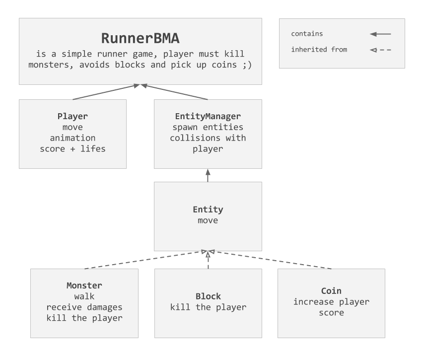

Tutoriel
========

Afin de réaliser le jeu, on utilisera la bibliothèque [ThreeJS](https://github.com/mrdoob/three.js/). Pour vous familiariser avec, allez à jeter un coups d'oeil aux démos [sur le site](http://threejs.org/) ;).

En plus des outils proposés de base par ThreeJS, on utilisera aussi quelques "plugins" de ma propre fabrication :

- [__THREE.Context__](https://github.com/jeremt/THREE.Context) - fourni un squelette d'application 3D avec camera, scène, gameClock...
- [__THREE.Input__](https://github.com/jeremt/THREE.Input) - permet la gestion des évènements clavier et souris.
- [__THREE.SpriteAnimation__](https://github.com/jeremt/THREE.SpriteAnimation) - génère et joue des animations 2D.
- [__THREE.ThirdPersonControls__](https://github.com/jeremt/THREE.ThirdPersonControls) - fourni un controller de type camera [TPS](http://en.wikipedia.org/wiki/Third-person_shooter).

Sommaire
---------

- Plan d'attaque !
- Player
- Entities
  - Entity
  - EntityManager
  - Blocks
  - Coins
  - Monster
- HUD
- GUI
- Effects
  - Particles
  - PostFxs
  - Simple tricks
- Conclusion

Plan d'attaque !
----------------

Avant de se lancer, il faut TOUJOURS mettre en place les grandes lignes du projet. Ici on va faire une sorte d'UML simplifié pour décrire simplement les différentes "classes" du jeu (si on peut appeler ça des classes en JS :/).

La suite
--------

Coming soon <3
